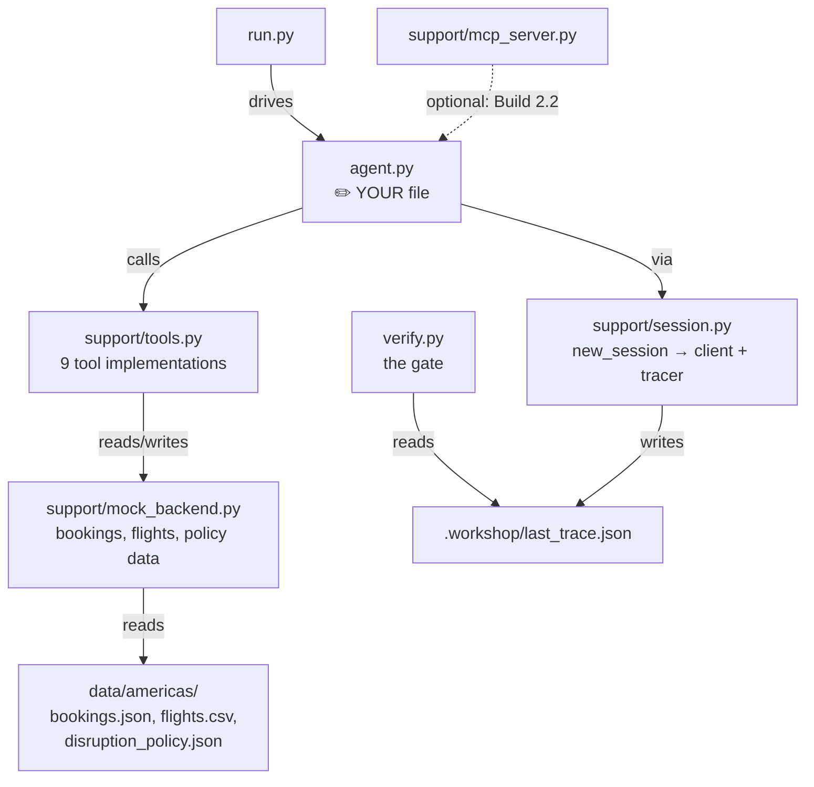
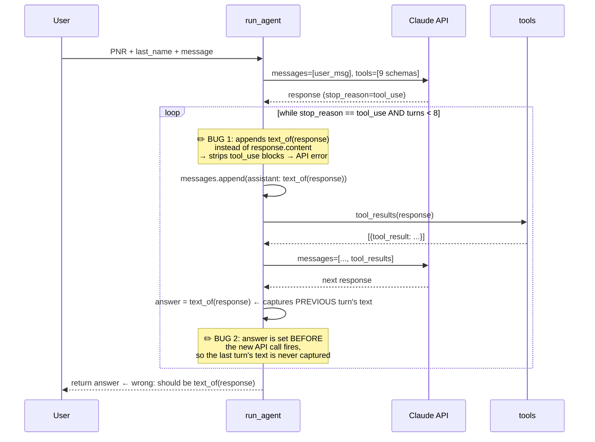
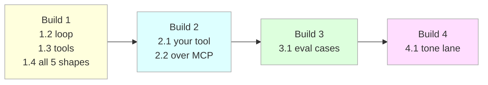

# Larkspur Disruption Agent — Repo Overview

## What it is

A hands-on exercise where you build a **multi-turn tool-calling agent** for Larkspur Airlines. Claude handles disrupted passengers by calling a suite of nine tools (look up bookings, check policy, rebook, issue vouchers, escalate). You write `agent.py`; everything else is given.

---

## Repo structure



---

## The agent loop (and its bugs)



---

## The six editable places (`grep -n '✏' agent.py`)

| Build | Step | Mark | What you write |
|-------|------|------|----------------|
| 1 | 1.2 | `run_agent()` | Fix the tool loop — append `response.content`, return `text_of(response)` |
| 1 | 1.3 | `build_tools()` | Fix tool descriptions so Claude routes correctly |
| 2 | 2.1 | `EXTRA_TOOLS` + `LOCAL_TOOLS` | Add your own tool schema + implementation |
| 2 | 2.2 | `tool_list()` | Route some tools over MCP instead |
| 3 | 3.1 | `evals/cases.json` | Write eval cases (via `/case` command) |
| 4 | 4.1 | `TONE_ADDENDUM` | Add intelligence/tone lane to system prompt |

---

## Current bugs to diagnose

**Bug 1 — `run_agent()` line 71** (`messages.append` inside loop):

```python
# Wrong — strips tool_use blocks, API rejects the conversation
messages.append({"role": "assistant", "content": text_of(response)})

# Should be
messages.append({"role": "assistant", "content": response.content})
```

**Bug 2 — `run_agent()` return value** (line 80):

```python
# Wrong — captures text before the next API call, so last turn is lost
answer = text_of(response)   # set here, THEN new response overwrites it
response = client.messages.create(...)
...
return answer  # one turn behind

# Should be
return text_of(response)  # after the loop, captures the final turn
```

**Bug 3 — `search_alternatives` description** (line 130):

```python
"description": "search",  # 6 characters — Claude has no routing signal
```

The gate for step 1.3 will fail here. Fix: write a full description of when Claude should call this tool and what it needs to already know before calling it.

---

## Build order and gates



Each step has a gate: `python3 verify.py <step>` — it checks the **wire** (what actually went to the API), not your code shape. Any implementation that produces the right behavior passes.

---

## The nine tools

| Tool | Kind | Description quality |
|------|------|---------------------|
| `lookup_booking` | Read | Good — both args explained |
| `get_flight_status` | Read | Good — date format specified |
| `search_alternatives` | Read | **Bad** — description is just `"search"` |
| `check_policy` | Read | Good — explains what it re-derives |
| `hold_seat` | Write | Minimal but adequate |
| `confirm_rebooking` | Write | Good — explains token requirement |
| `issue_voucher` | Write | Good — explains auto-approve threshold |
| `escalate_to_human` | Write | Good — frames escalation as correct outcome |
| `send_confirmation` | Write | Minimal |

---

## Diagnostic commands

| Command | Purpose |
|---------|---------|
| `python3 run.py K7PQ2M --trace` | See every API turn, tool calls, and results |
| `python3 run.py --show-tools` | What Claude actually reads about each tool |
| `python3 run.py --tool-tax` | Token cost of your tool list |
| `python3 run.py --all --trace` | Run all 5 Stage-1 shapes |
| `python3 verify.py 1.2` | Check if your loop passes the gate |
| `python3 verify.py` | Status board — what's banked |

**Start here:** `python3 run.py K7PQ2M --trace` — read the wire. The trace shows Bug 1 and Bug 2 before any code tour does.
